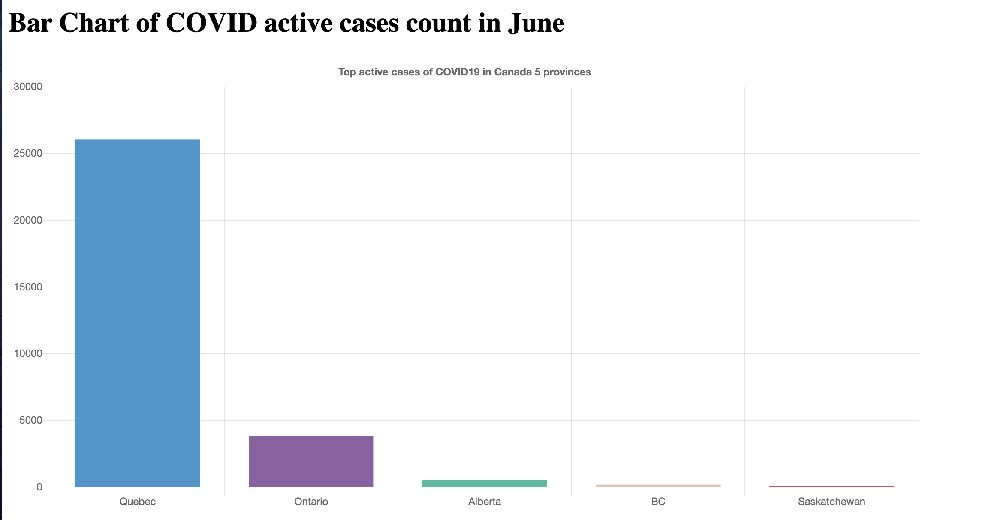

# COVID_Dashboard

## Introduction:
During COVID quarantine time, the dashboard becomes a great tool to better know the epidemiological trend of case, death, and recovered counts etc. The dashboard provides the COVID insight at Canada provincial level along with some analytics on each plot. The data can be accessed with its [link](https://github.com/ishaberry/Covid19Canada)

## Technical Skillset:
- Chart.js
- Javascript
- Css
- html
- php
- Python

## website
### BarChart
#### analytics
Through the bar chart, we can see the information by the hovered information. Quebec has the most people infected with COVID among 5 provinces for up to 26k in June, while Ontario is the second highest one with 3800 people.
  
