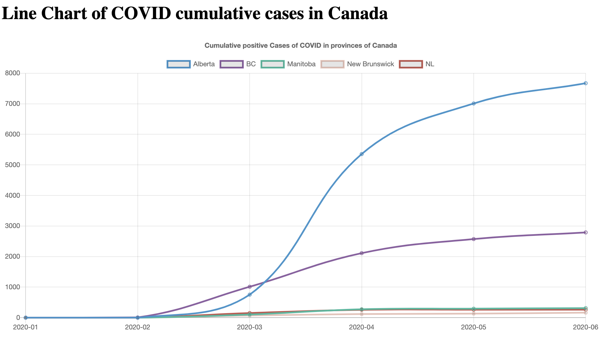
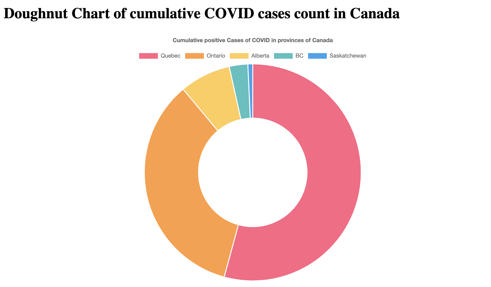
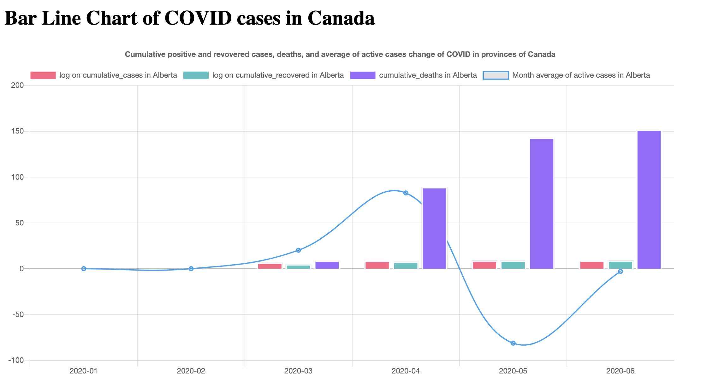

# COVID_Dashboard

## Introduction:
During COVID quarantine time, the dashboard becomes a great tool to better know the epidemiological trend of case, death, and recovered counts etc. The dashboard provides the COVID insight at Canada provincial level along with some analytics on each plot. The data can be accessed with its [link](https://github.com/ishaberry/Covid19Canada)

## Technical Skillset:
- Chart.js
- Javascript
- Css
- html
- php
- Python

## website
### Bar Chart
#### analytics
Through the bar chart, we can see the information by the hovered information. Quebec has the most people infected with COVID among 5 provinces for up to 26k in June, while Ontario is the second highest one with 3800 people.  
  

### Line Chart
#### analytics
From the line plot, 4 provinces except BC are reported with 0 confirmed cases in January and February. From mid-February, there is a gradual increase in confirmed cases in Alberta and BC. Starting in March, a substantial increase of positive cases appear in Alberta as the AB province is the top among the 5 provinces. On the other hand, provinces like MB, NB, and NL are reported with low confirmed COVID cases. In May, the curve is flattened with fewer COVID cases.  
  

### Doughnut Chart
#### analytics
From the plot, we can see that province of Quebec has the largest confirmed cases of COVID while Ontario also shares a similar proportion of confirmed cases. On the other hand, province Alberta, BC and Saskatchewan has relatively low amount of people infected with COVID.  
  

### Bar Line Chart
#### analytics
From the bar-line chart, we can see a sharp increase in the average active cases change in April and a dramatic decrease in the average active cases change in May. From May to June, even though the number of active cases change remains negative, there’s an upward curve showing that more people get infected with COVID from May to June.  
  
